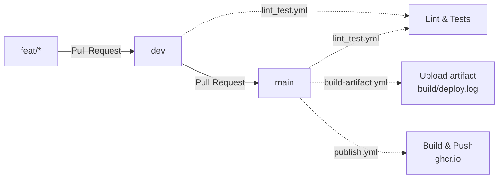

# TrustiPro — API CI/CD

URL du dépôt : <https://github.com/aydryun/EC06>

## 1. Workflow Git

### Stratégie de prefixes

Voici la liste des préfixes autorisés pour ce projet

| prefix | Description                                            |
|-------|--------------------------------------------------------|
| feat  | Nouvelle fonctionnalité                                |
| fix   | Correction de bugs applicatifs |
| docs  | Changement dans la documentation                       |
| ref   | Refactorisation du code / amélioration de performances |
| style | Modification d'éléments stylistiques                   |
| typo  | Modification de textes                                 |
| test  | Ajout / modification de tests applicatifs              |
| chore | Tâche de maintenance                                   |

#### Format de commits

- Tous les commits doivent utiliser un prefixe de la liste au dessus
- le message doit être rédigé en français sans accents

`(prefix): <description>`
`chore: modification du workflow git`

### Stratégie de branches

| Branche                | Description                                                                |
|------------------------|----------------------------------------------------------------------------|
| <prefix>/<fonctionnalité>  | branche en cours développement, ajout de fonctionnalités modifications |
| dev                    | branche développement, où les fonctionnalités sont implémentées            |
| main                   | Branche principale, push directs interdits                                 |

Chaque branche doit réutiliser un préfixe de la liste des préfixes autorisés
accompagné de la fonctionnalité / son but

Ex:
`docs/conventions` : Branche visant à ajouter la documentation concernant les conventions de code

### Pull request

Chaque demande de pull request doit suivre ce format de message

```md
<Description>

# Type de PR
- element 1
- element n 

....


lexique (optionnel)

```

Ex:

```md
Cette pull request vise à ajouter les conventions de code du projet

# docs
- ajout de conventions.md
- modification des personas 
- mise à jour de la documentation de workflow

```

## 2. Conteneurisation Docker

La Conteneurisation se fait avec le docker compose qui prend en compte le `Dockerfile`
Dans le workflow lintest une conteneurisation a lieu pour exectuer les commandes de lint et de test
ce qui permet aux commandes d'etre lancé dans l'environement directement

## 3. Pipeline CI/CD



Le graphique represente la pipline de deploiement ci

Le build artifact marche corretement, le lien peut etre trouver en accedant aux log d'un des workflow de publications
<https://github.com/aydryun/EC06/actions/workflows/build-artifact.yml>, une execution choisis il faut se rendre à l'étape
Upload de l'articat, et dans la derniere ligne de cette etape il y a le lien de telechargement !

## 4. Gestion des secrets

Les secrets sont definis dans l'enveironement github est sont utiliser dans la partie lint_test
permettant de faire les healthchecka de la ligne 42 à 43 du fichier de workflow.

## 5. Lancement et utilisation du projet

```bash
git clone https://github.com/aydryun/EC06
cd EC06

cp .env.dist .env
#remplir les valeurs par des valeurs personnels

docker compose up -d 

#Se rendre sur localhost:3000 pour voir l'api


```
